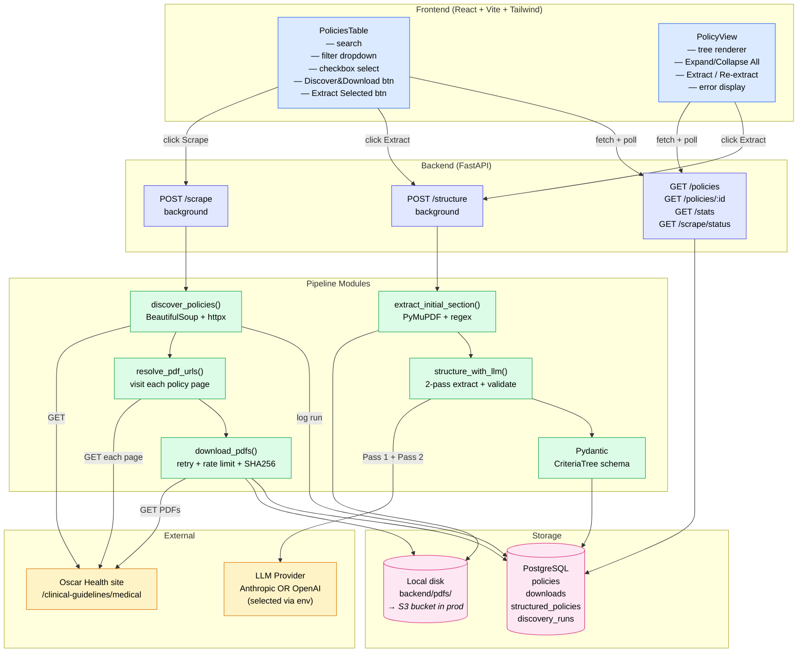
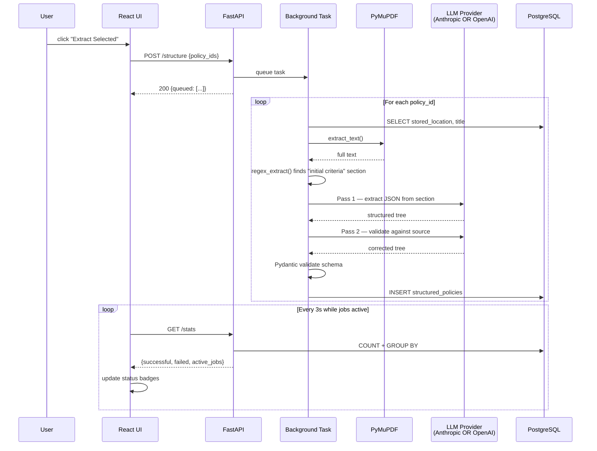
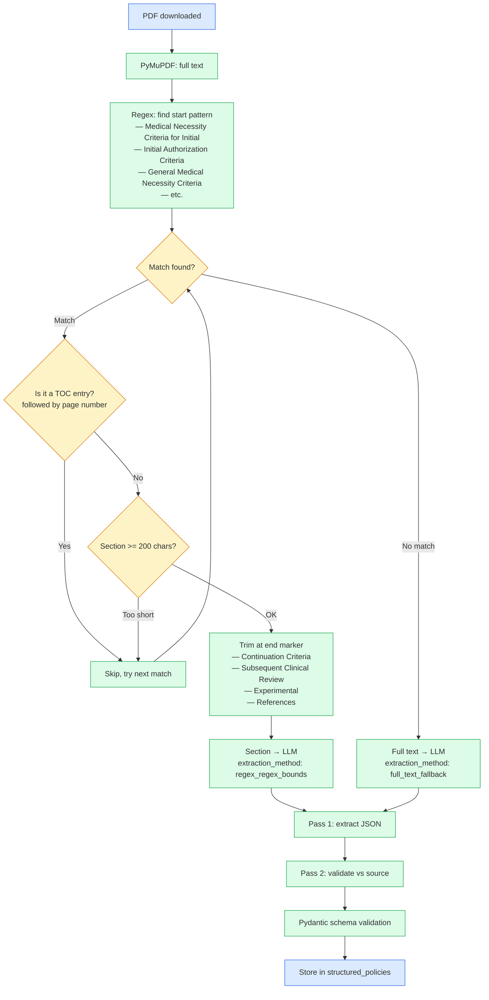
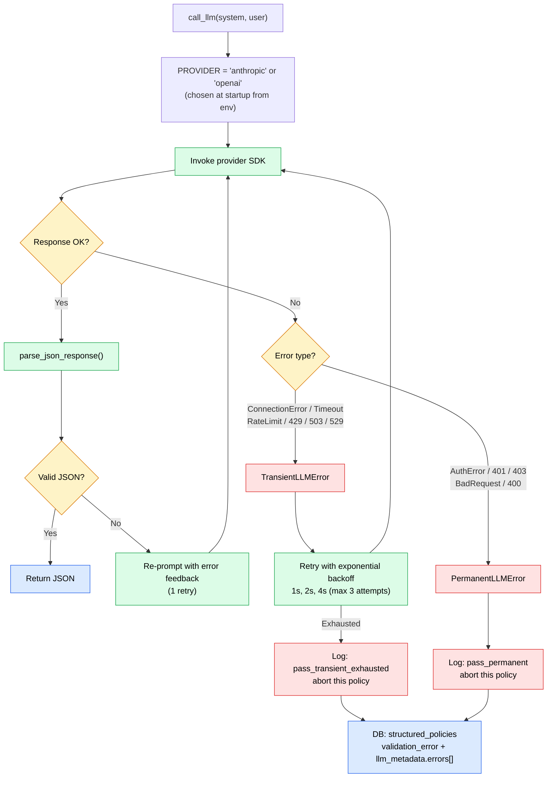

# System Design — Oscar Medical Guidelines Pipeline

## High-level architecture

## Data flow per policy

## Initial-only selection decision tree

## Error handling cascade

Single provider (Anthropic or OpenAI, selected at startup). Errors are classified into two types; retry policy depends on the type.

### Classification rules

| Provider error | Type | Retry? |
|----------------|------|--------|
| `APIConnectionError` | Transient | ✓ exp backoff (1s, 2s, 4s) |
| `APITimeoutError` | Transient | ✓ |
| `RateLimitError` | Transient | ✓ |
| Status 429, 503, 529 | Transient | ✓ |
| `AuthenticationError` / 401, 403 | Permanent | ✗ abort |
| Status 400 / bad request | Permanent | ✗ abort |
| Any other exception | Raised to caller | — |

### JSON-level retry

Separate from error retries. If the LLM returns malformed JSON:
- **Retry once** with the parse error appended to the prompt
- If second attempt also fails, log `passN_invalid_json` and abort the policy

### Pass 2 downgrade

If Pass 2 (validation pass) hits any terminal error, falls back to Pass 1's result rather than losing the extraction. Logged as `pass2_..._using_pass1` in metadata.
