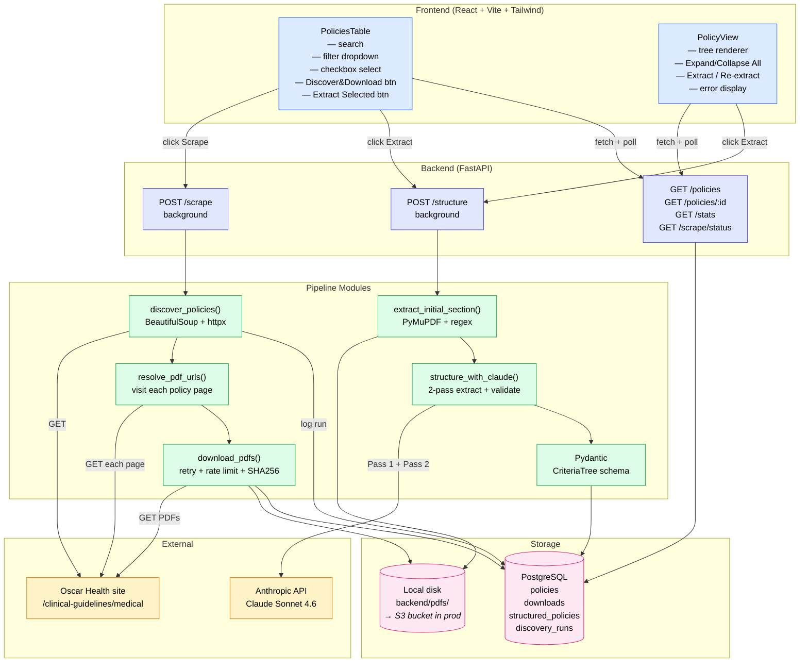
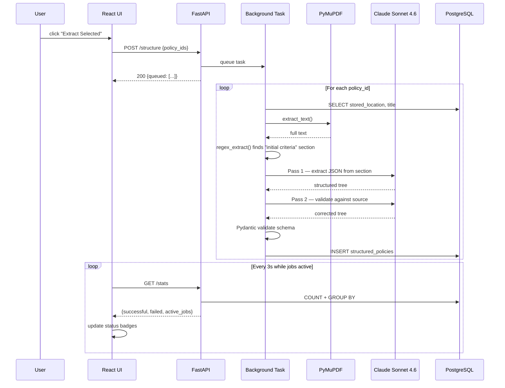
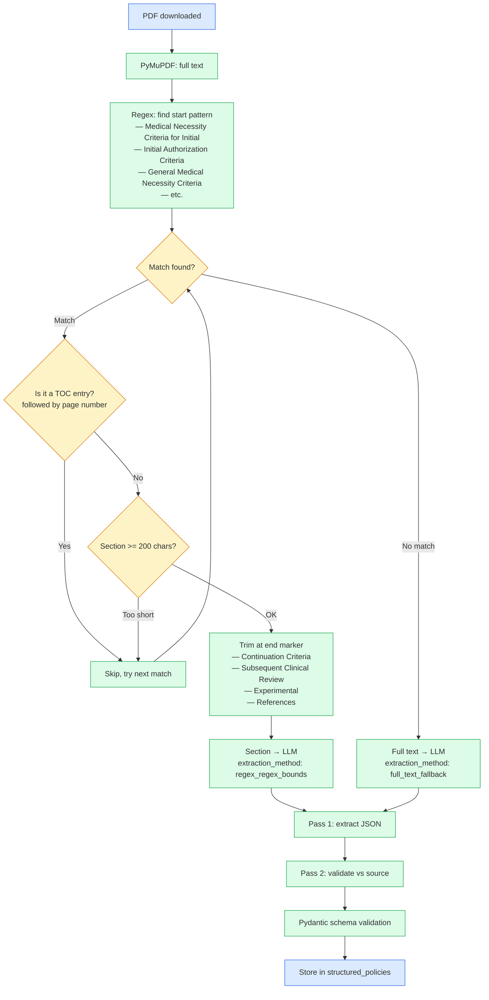
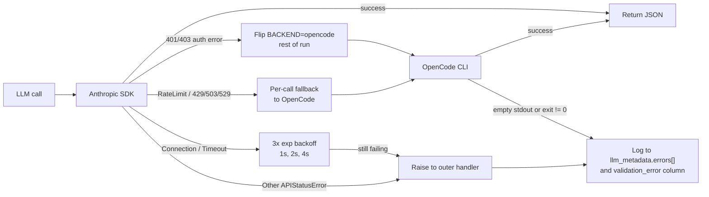

# System Design — Oscar Medical Guidelines Pipeline

## High-level architecture

```mermaid
flowchart TB
    subgraph External["External"]
        Oscar["Oscar Health site<br/>/clinical-guidelines/medical"]
        Anthropic["Anthropic API<br/>Claude Sonnet 4.6"]
    end

    subgraph UI["Frontend (React + Vite + Tailwind)"]
        PoliciesTable["PoliciesTable<br/>— search<br/>— filter dropdown<br/>— checkbox select<br/>— Discover&Download btn<br/>— Extract Selected btn"]
        PolicyView["PolicyView<br/>— tree renderer<br/>— Expand/Collapse All<br/>— Extract / Re-extract<br/>— error display"]
    end

    subgraph API["Backend (FastAPI)"]
        Scrape["POST /scrape<br/>background"]
        Structure["POST /structure<br/>background"]
        ListAPI["GET /policies<br/>GET /policies/:id<br/>GET /stats<br/>GET /scrape/status"]
    end

    subgraph Pipeline["Pipeline Modules"]
        Discover["discover_policies()<br/>BeautifulSoup + httpx"]
        Resolve["resolve_pdf_urls()<br/>visit each policy page"]
        Download["download_pdfs()<br/>retry + rate limit + SHA256"]
        Extract["extract_initial_section()<br/>PyMuPDF + regex"]
        LLM["structure_with_claude()<br/>2-pass extract + validate"]
        Validate["Pydantic<br/>CriteriaTree schema"]
    end

    subgraph Storage["Storage"]
        Postgres[("PostgreSQL<br/>policies<br/>downloads<br/>structured_policies<br/>discovery_runs")]
        Disk[("Local disk<br/>backend/pdfs/<br/><i>→ S3 bucket in prod</i>")]
    end

    %% Frontend → API
    PoliciesTable -->|click Scrape| Scrape
    PoliciesTable -->|click Extract| Structure
    PoliciesTable -->|fetch + poll| ListAPI
    PolicyView -->|fetch + poll| ListAPI
    PolicyView -->|click Extract| Structure

    %% Scrape flow
    Scrape --> Discover
    Discover -->|GET| Oscar
    Discover --> Resolve
    Resolve -->|GET each page| Oscar
    Resolve --> Download
    Download -->|GET PDFs| Oscar
    Download --> Disk
    Download --> Postgres
    Discover -->|log run| Postgres

    %% Structure flow
    Structure --> Extract
    Extract --> Disk
    Extract --> LLM
    LLM -->|Pass 1 + Pass 2| Anthropic
    LLM --> Validate
    Validate --> Postgres

    %% API reads
    ListAPI --> Postgres

    classDef external fill:#fef3c7,stroke:#d97706,color:#000
    classDef ui fill:#dbeafe,stroke:#2563eb,color:#000
    classDef api fill:#e0e7ff,stroke:#4f46e5,color:#000
    classDef pipeline fill:#dcfce7,stroke:#16a34a,color:#000
    classDef storage fill:#fce7f3,stroke:#db2777,color:#000

    class Oscar,Anthropic external
    class PoliciesTable,PolicyView ui
    class Scrape,Structure,ListAPI api
    class Discover,Resolve,Download,Extract,LLM,Validate pipeline
    class Postgres,Disk storage
```

## Data flow per policy

```mermaid
sequenceDiagram
    participant User
    participant UI as React UI
    participant API as FastAPI
    participant BG as Background Task
    participant PDF as PyMuPDF
    participant LLM as Claude Sonnet 4.6
    participant DB as PostgreSQL

    User->>UI: click "Extract Selected"
    UI->>API: POST /structure {policy_ids}
    API->>BG: queue task
    API-->>UI: 200 {queued: [...]}

    loop For each policy_id
        BG->>DB: SELECT stored_location, title
        BG->>PDF: extract_text()
        PDF-->>BG: full text
        BG->>BG: regex_extract() finds "initial criteria" section
        BG->>LLM: Pass 1 — extract JSON from section
        LLM-->>BG: structured tree
        BG->>LLM: Pass 2 — validate against source
        LLM-->>BG: corrected tree
        BG->>BG: Pydantic validate schema
        BG->>DB: INSERT structured_policies
    end

    loop Every 3s while jobs active
        UI->>API: GET /stats
        API->>DB: COUNT + GROUP BY
        API-->>UI: {successful, failed, active_jobs}
        UI->>UI: update status badges
    end
```

## Initial-only selection decision tree

```mermaid
flowchart TD
    Start["PDF downloaded"] --> Extract["PyMuPDF: full text"]
    Extract --> Regex["Regex: find start pattern<br/>— Medical Necessity Criteria for Initial<br/>— Initial Authorization Criteria<br/>— General Medical Necessity Criteria<br/>— etc."]

    Regex --> Found{"Match found?"}
    Found -->|No match| Fallback["Full text → LLM<br/>extraction_method: full_text_fallback"]

    Found -->|Match| TOCCheck{"Is it a TOC entry?<br/>followed by page number"}
    TOCCheck -->|Yes| NextMatch["Skip, try next match"]
    NextMatch --> Found

    TOCCheck -->|No| LenCheck{"Section >= 200 chars?"}
    LenCheck -->|Too short| NextMatch
    LenCheck -->|OK| EndMarker["Trim at end marker<br/>— Continuation Criteria<br/>— Subsequent Clinical Review<br/>— Experimental<br/>— References"]

    EndMarker --> Section["Section → LLM<br/>extraction_method: regex_regex_bounds"]

    Section --> Pass1["Pass 1: extract JSON"]
    Fallback --> Pass1
    Pass1 --> Pass2["Pass 2: validate vs source"]
    Pass2 --> Pydantic["Pydantic schema validation"]
    Pydantic --> Store["Store in structured_policies"]

    classDef decision fill:#fef3c7,stroke:#d97706
    classDef action fill:#dcfce7,stroke:#16a34a
    classDef terminal fill:#dbeafe,stroke:#2563eb

    class Found,TOCCheck,LenCheck decision
    class Extract,Regex,NextMatch,EndMarker,Section,Fallback,Pass1,Pass2,Pydantic action
    class Start,Store terminal
```

## Error handling cascade

```mermaid
flowchart LR
    Call["LLM call"] --> Primary["Anthropic SDK"]
    Primary -->|success| Done["Return JSON"]
    Primary -->|401/403 auth error| Switch["Flip BACKEND=opencode<br/>rest of run"]
    Primary -->|RateLimit / 429/503/529| Fallback1["Per-call fallback<br/>to OpenCode"]
    Primary -->|Connection / Timeout| Retry["3x exp backoff<br/>1s, 2s, 4s"]
    Primary -->|Other APIStatusError| Raise["Raise to outer handler"]

    Retry -->|still failing| Raise
    Switch --> OpenCode["OpenCode CLI"]
    Fallback1 --> OpenCode

    Raise --> Log["Log to llm_metadata.errors[]<br/>and validation_error column"]
    OpenCode -->|success| Done
    OpenCode -->|empty stdout or exit != 0| Log
```
